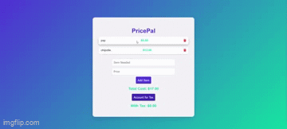

# PricePal
**IMPORTANT: app will take 50 seconds to load (it is hosted for free) Submit and delete route disabled because I don't want to moderate**

This is an app that tracks groceries you need to buy, and gives an option to calculate the tax if need be. Mark as bought or not by clicking item. Result stored in database and remains after refresh!

**Link to project:** https://pricepal-wzhd.onrender.com/

    

## How It's Made: 

**Tech used:** JavaScript Express MongoDB

I took a template for a to do list and reconfigured it to my needs. I added some css to make the app a bit more lively. Moving into the js, I included a method to track if a item had been purchased or not, this would allow the total cost be affected by items purchased or unpurchased. Completed vs uncompleted (purchased vs unpurchased) have their own routes within the server.js. I also included the ability to delete items which will also influence the total price. The beautiful thing about ejs is I did not have to hard code any entries. The spans will update accordingly based on what has been submitted to the data base. 

## Optimizations
I would like to comeback and change each entry to be marked as a food or non food item so the tax can be calculated automatically in the total cost.

## Lessons Learned

I got to practice using ejs to maintain a app that can be modified by users. I am grateful to express to making the process of creating routes for every task bearable. There are many lines of code in this project I could not produce from memory, but I enjoy knowing what it means and how to see it.
